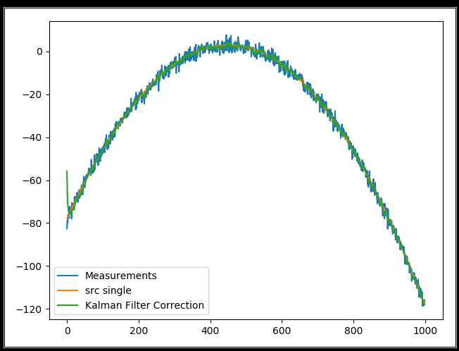
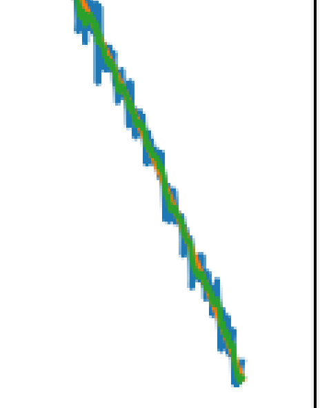

Implementation of Kalman filter in 30 lines using Numpy. 

原始链接:https://github.com/zziz/kalman-filter

修改其中参数不合理的地方，整体并未做太大改变，具体参考代码。        

Running: ```python kalman-filter.py```

```python

import numpy as np


class KalmanFilter(object):

    def __init__(self, F=None, B=None, H=None, Q=None, R=None, P=None, x0=None):

        if (F is None or H is None):
            raise ValueError("Set proper system dynamics.")

        self.n = F.shape[1]
        self.m = H.shape[0]

        self.F = F              # 状态转移矩阵 大小 n*n  n表示选取的状态变量
        self.H = H              # 测量数据的大小 大小为 m*n  m是测量变量的大小
        self.B = 0 if B is None else B                          # 输入矩阵 n*k
        self.Q = np.eye(self.n) if Q is None else Q             # 系统噪声协方差矩阵 n*n
        self.R = np.eye(self.m) if R is None else R             # 测量噪声协方差矩阵 大小跟测量变量有关系 m*m
        self.P = np.eye(self.n) if P is None else P             # 状态变量误差协方差矩阵  大小 n*n
        self.x = np.zeros((self.n, 1)) if x0 is None else x0    # 状态变量 大小 n*1

    def predict(self, u=0):
        self.x = np.dot(self.F, self.x) + np.dot(self.B, u)
        self.P = np.dot(np.dot(self.F, self.P), self.F.T) + self.Q
        return self.x

    def update(self, z):
        y = z - np.dot(self.H, self.x)
        S = self.R + np.dot(self.H, np.dot(self.P, self.H.T))
        K = np.dot(np.dot(self.P, self.H.T), np.linalg.inv(S))
        self.x = self.x + np.dot(K, y)                          # 计算当前时刻的估计值
        I = np.eye(self.n)
        self.P = np.dot(I - np.dot(K, self.H), self.P)
        return self.x


def example():
    dt = 1.0 / 60
    F = np.array([[1, dt, 0], [0, 1, dt], [0, 0, 1]])
    H = np.array([1, 0, 0]).reshape(1, 3)                   # 这里测量变量只有一个
    Q = np.array([[0.05, 0.05, 0.0], [0.05, 0.05, 0.0], [0.0, 0.0, 0.0]])
    R = np.array([0.5]).reshape(1, 1)

    x = np.linspace(-10, 10, 1000)
    measurements = - (x ** 2 + 2 * x - 2) + np.random.normal(0, 2, 1000)     # 模拟测量值z
    src_array = - (x ** 2 + 2 * x - 2)

    kf = KalmanFilter(F=F, H=H, Q=Q, R=R)
    predictions = []

    for z in measurements:
        kf.predict()
        predictions.append(np.dot(kf.H, kf.update(z))[0])

    import matplotlib.pyplot as plt
    plt.plot(range(len(measurements)), measurements, label='Measurements')
    plt.plot(range(len(src_array)), np.array(src_array), label='src single')
    plt.plot(range(len(predictions)), np.array(predictions), label='Kalman Filter Correction')
    plt.legend()
    plt.show()


if __name__ == '__main__':
    example()
```

#### Output




可以看出跟踪时间越久，噪声干扰越小。